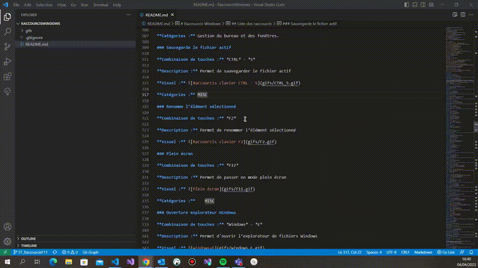

### Positionner plusieurs curseurs ALT+Click 
**Descriptif:** Permet de positionner plusieurs curseurs où le désire l'utilisateur pour permettre la modification.

**Combinaison de touches:** + 

**Visuel:** 
