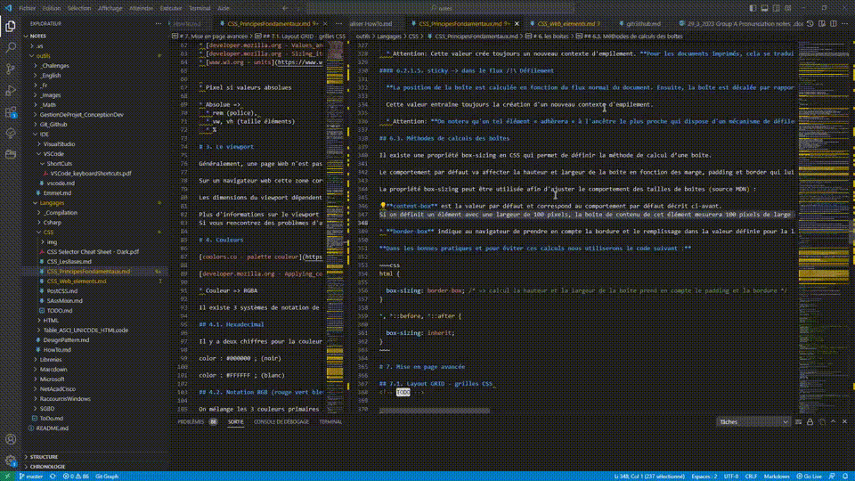

### Activer, désactiver le retour automatique à la ligne ALT+Z

**Descriptif :** Permet d'adapter l'affichage de la page à l'écran par des retours à la ligne, ou revenir à un affichage sans sauts de ligne

**Combinaison de touches :**  + 

**Visuel :** 

{
  "key": "alt+z",
  "command": "editor.action.toggleWordWrap"
}