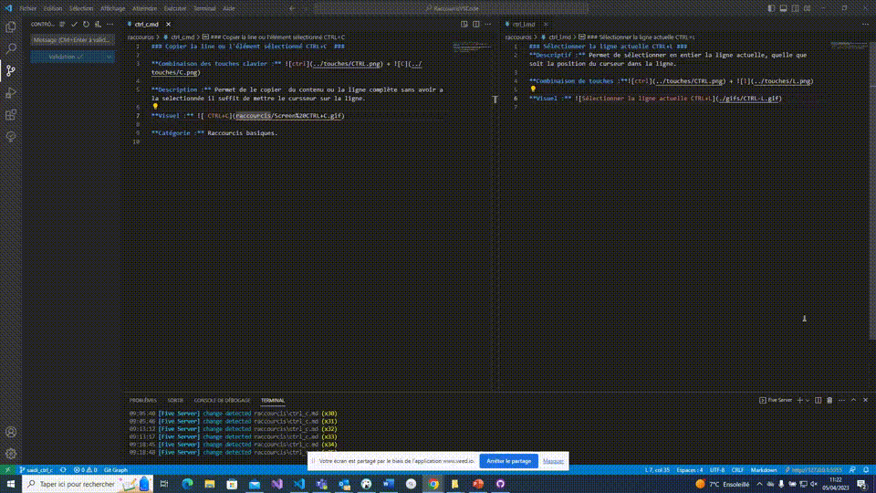

### Copier la ligne ou le contenu sélectionné CTRL+C

**Combinaison de touches :**  + 

**Descriptif :** Permet de copier le contenu sélectionné ou de copier la ligne complète sans avoir à la sélectionner, il suffit simplement de mettre le curseur sur la ligne.

**Visuel :** 

**Catégorie :** Raccourcis basiques

