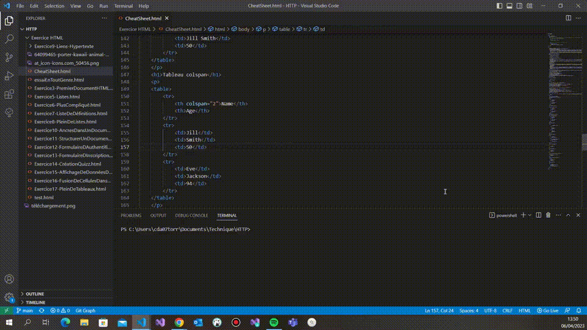

### Positionner le curseur sur plusieurs lignes CTRL + MAJ + ALT + *Touches directionnelle* 

**Descriptif:** Positionner le curseur sur plusieurs lignes, même celles revenues à la ligne après un ALT + Z, au même emplacement et de déplacer les positions vers la droite ou la gauche simultanément et ainsi permettre la modification.

**Positionner le curseur sur plusieurs lignes:**  +  + ///

**Visuel:** 
