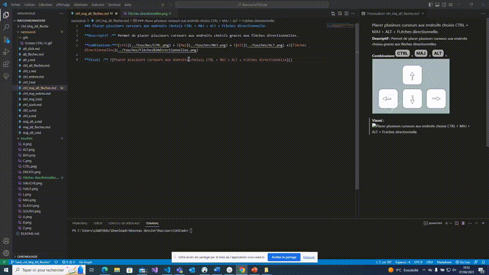

### Placer plusieurs curseurs aux endroits choisis CTRL + MAJ + ALT + FLèches directionnelle.

**Descriptif :** Permet de placer plusieurs curseurs aux endroits choisis graces aux flèches directionnelles.

**Combinaison:** +  +  +

**Visuel :** 

**Catégorie :** Multis curseurs