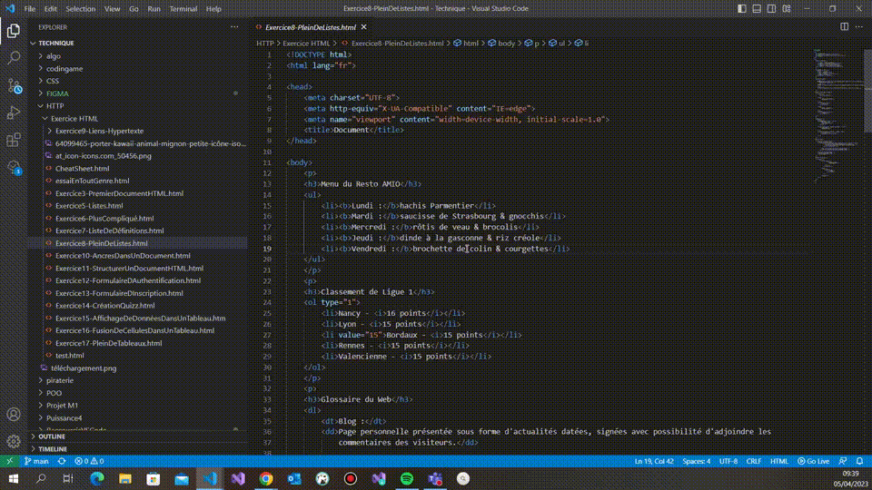

### Positionner le curseur sur plusieurs lignes CTRL+ALT+Haut/Bas 

**Descriptif:** Positionner plusieurs curseurs sur les différentes lignes si la ligne est assez grande, sinon se place à la fin de la ligne.

**Positionner le curseur sur plusieurs lignes:** +  + /

**Visuel:** 
