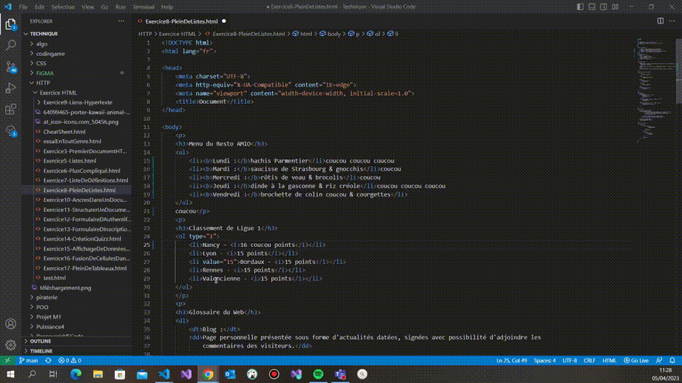

### Sélectionner toutes les occurrences du mot où est positionné le curseur ou d'une sélection CTRL + MAJ + L 

**Descriptif :** Permet de sélectionner toutes les occurrences du mot où est positionné le curseur ou d'une sélection, ce qui permet d'effectuer des modifications sur tous les éléments en même temps.

**Combinaison de touches :**  +  + 

**Visuel :** 