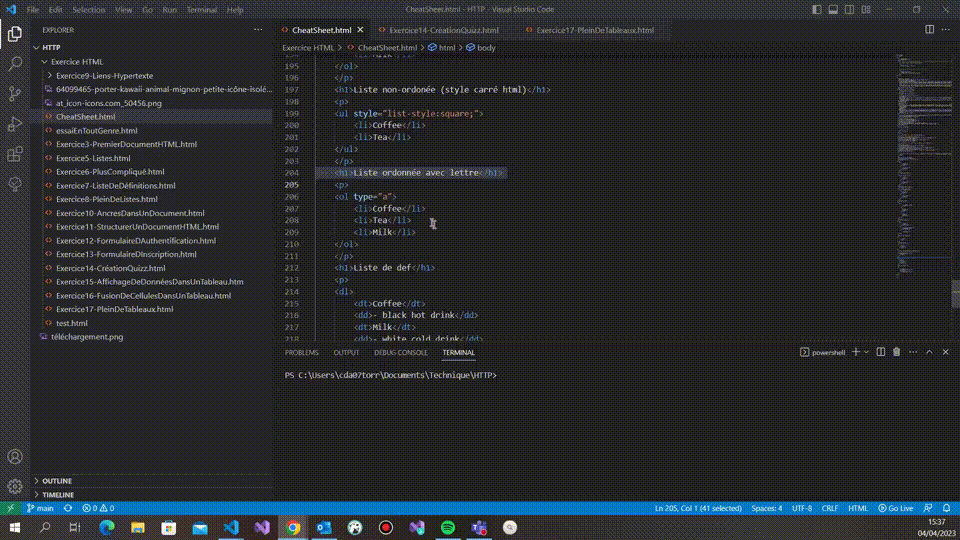

### Sélectionner toutes les occurences du mot ou de la selection CTRL+MAJ+L 
**Descriptif :** Permet de sélectionner en entier la ligne actuelle, quelle que soit la position du curseur dans la ligne.

**Combinaison de touches :** ++ 

**Visuel :** 