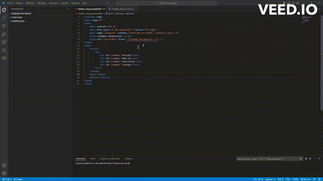

### Commenter la ligne entière où est positionné le curseur ou une zone sélectionnée CTRL + / ###

**Descriptif :** Permet de commenter la ligne entière où est positionné le curseur ou une zone sélectionnée

**Combinaison de touches :**  + 

**Visuel :** 
