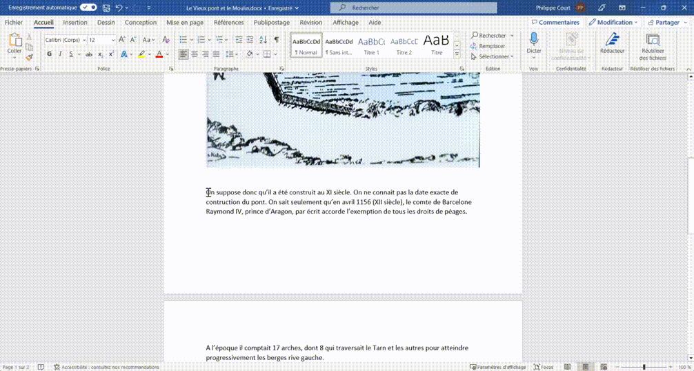

### Coupe une zone de texte CTRL+ X

**Descriptif :** Permet de Couper une zone de texte sélectionnée pour la déplacer vers le presse-papier ou une autre zone du texte.

**Combinaison de touches :** + 

**Visuel :** 
