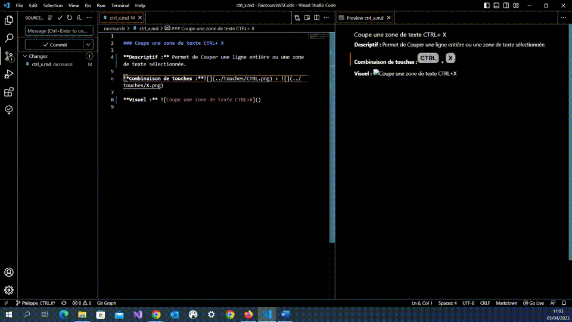

### Couper une zone de texte CTRL + X

**Descriptif :** Permet de couper la ligne où est positionné le curseur ou une zone de texte sélectionnée, qui sera mise dans le presse-papier.

**Combinaison de touches :** + 

**Visuel :** 
