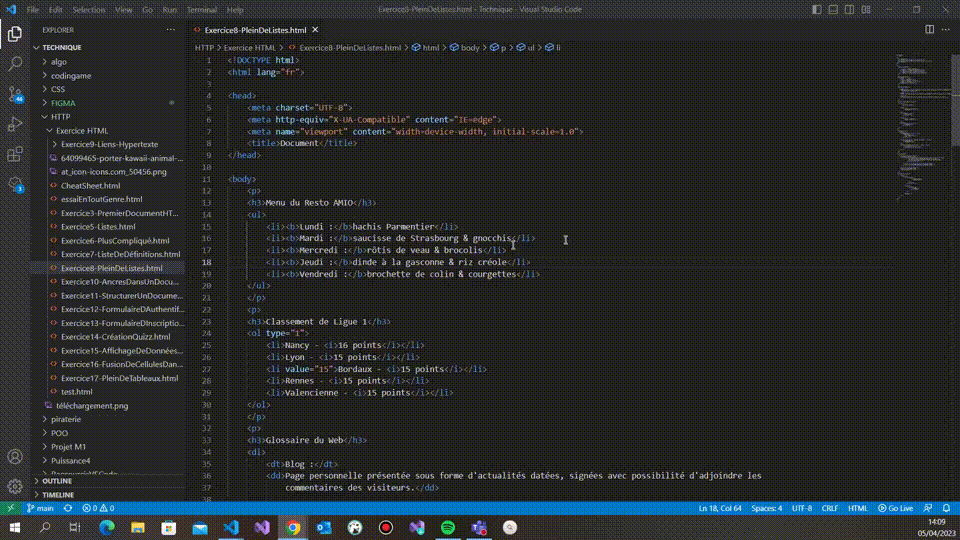

### Copier la ligne où se trouve le curseur au-dessus ou en dessous MAJ + ALT + HAUT/BAS

**Descriptif :** Permet de copier la ligne où se trouve le curseur au-dessus ou en dessous de celle-ci. Et place le curseur sur le ligne nouvellement crée..

**Combinaison de touches :** +  + /

**Visuel :** 
