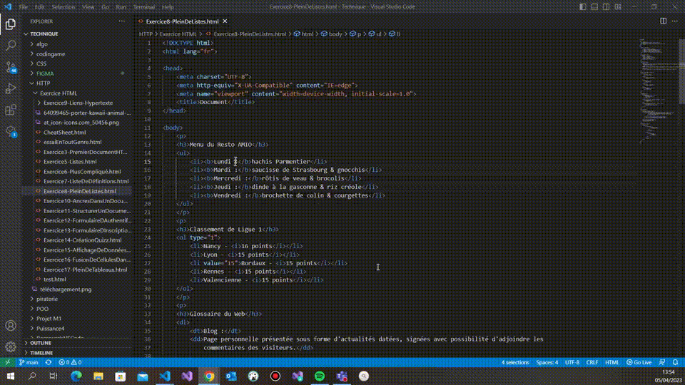

### Positionner plusieurs curseurs pour la sélection ALT + MAJ + I

**Descriptif :** Permet de positionner des curseurs à la fin de toutes les lignes de notre sélection et à la fin de la sélection.

**Combinaison de touches :** +  + 

**Visuel :** 
